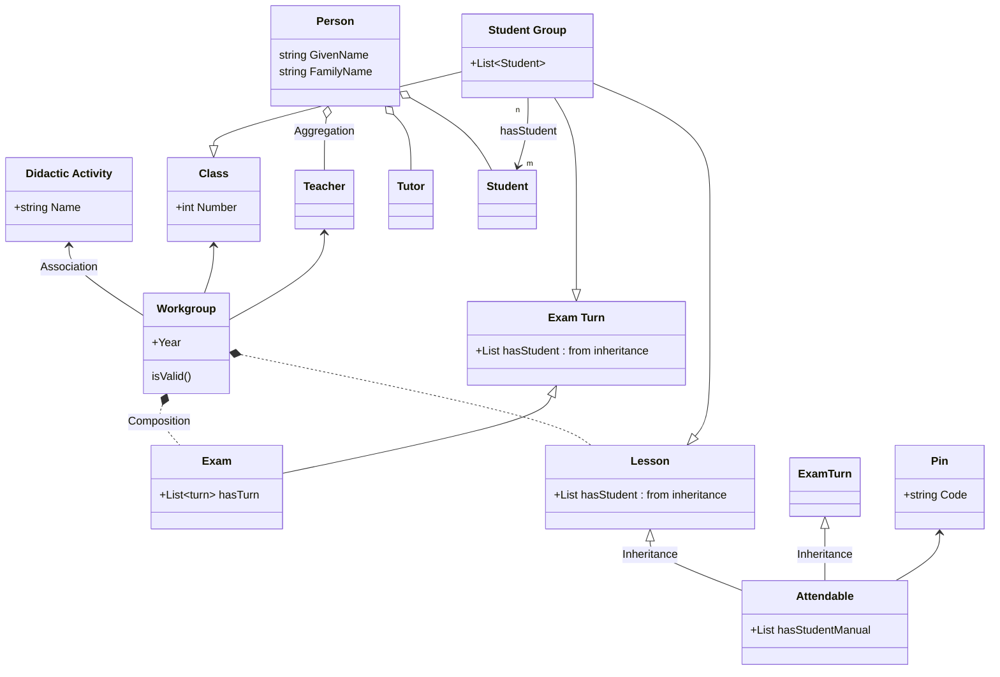

<h1><center>Attendance</center></h1>
<h3><center>Ontologia per la registrazione delle presenze in aula</center></h3>
<h5><center>Relazione elaborato Web Semantico</center></h5>

<table>
<tbody>
<td>
<span><center>Luca Giorgietti</center></span>
<span><center>luca.giorgietti7@studio.unibo.it</center></span>
</td>
<td>
<span><center>Daniele Tentoni</center></span>
<span><center>daniele.tentoni2@studio.unibo.it</center></span>
</td>
</tbody>
</table>

# Sviluppo Ontologia

## Classi

Di seguito viene riportato uno schema di massima della nostra ontologia:




*Sopra: uno schema di massima della nostra ontologia*

Vengono riportate le classi modellate in due classi più rilevanti e le altre (???).

### Person

Questo sostantivo rappresenta una qualunque persona interagisca con un sistema scolastico. Nel nostro elaborato esso modella solamente poche di tutte le possibilità, nello specifico:

* <a id="teacher">Teacher</a>: chi tiene le lezioni

* <a id="tutor">Tutor</a>: chi aiuta a gestire uno specifico workgroup

* <a id="student">Student</a>: chi segue le lezioni

### Workgroup

Rappresenta una [Classe](#classe) che partecipa in un determinato anno didattico e semestre ad una [Attività Didattica](#attivita-didattica).

#### Classe

Rappresenta un gruppo di studenti iscritti in un certo anno accademico.

#### Attività Didattica

Rappresenta un corso di studio insegnato nella scuola. Un esempio può essere *Matematica* o *Economia*.

### Attendable

Rappresenta un concetto(???) sul quale può essere registrata una presenza.

### Lesson

Rappresenta un quanto di tempo dove gli [studenti](#student) seguono un [professore](#teacher). Eventualemnte, il professore può essere aiutato o sostituito da un [tutor](#tutor).

### Exam

Rappresenta un quanto di tempo dove gli [studenti](#student), divisi in [turni](#exam-turn) svolgono la propria prova.

#### Exam Turn

Rappresenta un quanto di tempo dove una parte di studenti iscritti ad un esame svolge la propria prova.

### Pin

Rappresenta un codice a 6 cifre che le persone usano per registrare la loro presenza ad un [Attendable](#attendable).

Possiede una data di creazione (*creation_date*) da valorizzare quando viene generato il Pin che è usata per calcolare tramite la regola ... la data di scadenza dello stesso. Allo scoccare della scadenza non sarà più possibile registrare una presenza sul Pin.

Elenco delle proprietà ???

### Attendance

Rappresenta una registrazione di una presenza. Essa quindi richiede un [Pin](#pin) associato ad un [Attendable](#attendable), cioè un impegno sul quale possa essere registrata una presenza.

### Student Group

Rappresenta un gruppo di studenti. Questa classe è usata esclusivamente nell'ontologia come superclasse per conferire la proprietà hasStudent alle sue sottoclassi

## Object Properties

Di seguito vengono specificate le principali Object Properties modellate. *Vengono elencate ma non esaustivamente spiegate le properties usate dalle ontologie importate.*

### hasStudent vs hasStudentManual

La prima proprietà esprime un elenco di studenti che appartengono ad un determinato Student Group a priori, mentre la seconda un elenco di studenti aggiunti a posteriori ad un Attendable.

# Regole Semantiche

# Interrogazioni

Tramite questa sintassi esprimiamo alcune delle più comuni query che potrebbero essere svolte sulla nostra ontologia.

**Query**:

* [L'ultimo pin creato per un Attendable](#lultimo-pin-creato-per-un-attendable)

## Ultimo pin valido per un determinato attendable

Selezioniamo l'ultimo pin valido per un attendable. Questa interrogazione viene usata quando si vuole presentare il pin sul quale gli studenti possono registrare la loro presenza.

In questo caso l'Attendable da usare è già noto, basta ordinare per data di creazione decresente i Pin che sono di un certo Attendable e prendere solo il primo.

```sparql
SELECT ?pin WHERE {
    ?attendable att:hasPin ?pin .
    ?pin att:creation-date ?creationDate .
    ?pin att:expiration-date ?expirationDate .

    BIND( now() AS ?currentDateTime ) # Get current date time
    FILTER (?attendable = att:LES_WS_2023_05_21) # This is the parameter
    FILTER (?expirationDate >= ?currentDateTime)
}

ORDER BY DESC(?creationDate) LIMIT 1
```

## Tutti i workgroup attivi per un determinato utente

Selezioniamo tutti i workgroup attivi per un utente per capire quali lezioni dovrà seguire o quali esami sostenere.

## Estrai uno studente presente casualmente

Seleziono uno studente preso a caso tra i presenti a lezione per verificare se realmente sia presente o è stato registrato da qualcun altro in modo malizioso.

In questo caso devo recuperare da tutti pin usati per la lezione tutte le presenze di un qualsiasi tipo valido e ne leggo soltanto una, la prima tra tutte quelle recuperate riordinate a caso.

```sparql
# Retrieve all attendance from an attendable.
SELECT ?attendance WHERE {
    ?attendable att:hasPin ?pin .
    ?pin att:hasAttendance ?attendance .
    ?attendance rdf:type att:AttendanceValid .

    FILTER (?attendable = att:LES_WS_2023_05_22) # This is the parameter
}

# Then order them randomly and take the first one.
ORDER BY RAND() LIMIT 1
```

## Studenti che possono sostenere l'esame (presenze > di tot %)
## Registro delle presenze

```sparql
SELECT ...
```