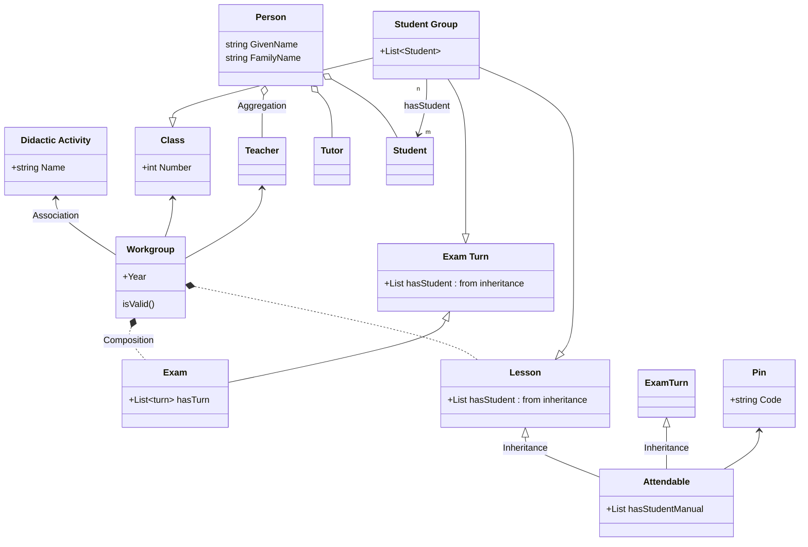

<h1><center>Attendance</center></h1>
<h3><center>Ontologia per la registrazione delle presenze in aula</center></h3>
<h5><center>Relazione elaborato Web Semantico</center></h5>

<center>
<table>
<tbody>
<td>
<span><center>Luca Giorgietti</center></span>
<span><center>luca.giorgietti7@studio.unibo.it</center></span>
</td>
<td>
<span><center>Daniele Tentoni</center></span>
<span><center>daniele.tentoni2@studio.unibo.it</center></span>
</td>
</tbody>
</table>
</center>

# Sviluppo Ontologia

In questa ontologia ci siamo prefissati di usare le seguenti tecnologie:

* **RDF**: linguaggio usato per la definizione di triplette di dati che permettono di creare delle informazioni utili a chi dovrà usare quegli stessi dati

* **RDFS**: linguaggio per fornire informazioni aggiuntive dai dati rappresentati usando RDF e che con il supporto di tool specifici chiamati *reasoner*, permette anche di comprendere maggiore conoscenza tramite l'uso di regole semantiche

* **OWL**: estensione di RDFS, permette di generare ancora più informazione

* **SPARQL**: linguaggio usato per interrogare ontologie e basi di dati semantiche come quelle in questione

* **Turtle**: sintassi usata in questi ambiti che risulta di più facile lettura anche da utenti umani

Come piattaforma per l'esecuzione delle query e la preparazione dell'ontologia, abbiamo usato principalmente Protégé, affiancato all'uso di reasoner e query enginer a riga ma che non avevano le stesse funzioni di Protégé e il risultato ottenuto non era mai uguale, per questo li abbiamo usati solo per contesti molto limitati.

Come ontologie esterne abbiamo pensato di includere:

* [**VCard**](https://www.w3.org/TR/vcard-rdf/): per descrivere le persone e le organizzazioni. Tramite questa ontologia si potrebbero meglio rappresentare anche le istituzioni di cui fanno parte le persone descritte, permettendo a questa ontologia di modellare una realtà più grande di un solo istituto accademico, ma di un intero sistema, campus condiviso da più atenei ecc...

* [**Foaf**](http://xmlns.com/foaf/0.1/#): per descrivere le relazioni tra le persone descritte. Di questa conoscenza ne viene usata tuttavia solamente una piccola parte, dato che a noi interessa esclusivamente, a questo livello, descrivere le relative lavorative tra esse. Di essa può essere usato anche:

    * [foaf:publications](http://xmlns.com/foaf/0.1/#term_publications)
    * [foaf:Organization](http://xmlns.com/foaf/0.1/#term_Organization)


## Presentazione del contesto

L'ontologia in questione nasce dall'esigenza dei due componenti del gruppo di esprimere la conoscenza di un dominio applicativo reale visto durante gli anni di lavoro presso un'azienda di sviluppo software locale.

Il requisito principale è quello di avere un sistema informatico per registrare la [presenza](#attendance) degli studenti quando sia necessario. Potrebbero essere [Lezioni](#lesson), [Esami](#exam) o altri momenti della vita accademica.

> L'adozione delle tecnologie sopracitate consentirà a chi usufruisce di questa ontologia di espanderla per includere gli impegni che richiedono la registrazione della presenza che gli servono.

## Classi

Di seguito viene riportato uno schema di massima della nostra ontologia:




*Sopra: uno schema di massima della nostra ontologia*

Vengono riportate le classi modellate in due classi più rilevanti e le altre (???).

### Person

Questo sostantivo rappresenta una qualunque persona interagisca con un sistema scolastico.

**Data Properties**

| Nome | Tipo |
| --- | --- |
| Given Name | string |
| Family Name | string |
| Birth Date | date |

**Object Properties**

| Nome | Dominio | Range |
| --- | --- | --- |
| has Gender | Person | Gender |
| has Attendant | Person | Gender |

Nel nostro elaborato esso modella solamente poche di tutte le possibilità, nello specifico:

* <a id="teacher">Teacher</a>(Teacher): chi tiene le lezioni

* <a id="tutor">Tutor</a>(Tutor): chi aiuta a gestire uno specifico workgroup

* <a id="student">Student</a>(Studente): chi principalmente partecipa alle lezioni.

    **Data Properties**

    | Nome | Tipo |
    | --- | --- |
    | studentId | string |

### Workgroup

Rappresenta una [Classe](#classe) che partecipa in un determinato anno didattico e semestre ad una [Attività Didattica](#attivita-didattica).

**Data Property**

| Nome | Tipo |
| --- | --- |
| wrk term | number |
| wrk year | number |

**Object Property**

| Nome | Dominio | Range |
| --- | --- | --- |
| hasClass | Workgroup | Class |
| hasDidacticActivity | Workgroup | DidacticActivity |
| hasExam | Workgroup | Exam |
| hasLesson | Workgroup | Lesson |
| hasTeacher | Workgroup | Teacher |

#### Classe

Rappresenta un gruppo di studenti iscritti in un certo anno accademico.

#### Attività Didattica

Rappresenta un corso di studio insegnato nella scuola. Un esempio può essere *Matematica* o *Economia*.

### Attendable

Rappresenta un concetto(???) sul quale può essere registrata una presenza. Da notare che questo concetto non viene completamente esaurito in questa ontologia. Infatti possiamo immaginare che nel solo ambito accademico possono essere ancora rappresentati altri tipi di eventi che possono avere interesse del registrare la presenza degli utenti, come a riunioni di docenti e di altro personale o ricevimenti privati.

**Data Property**

| Nome | Tipo |
| --- | --- |
| end time | date |
| start time | date |

**Object Property**

| Nome | Dominio | Range |
| --- | --- | --- |
| hasLocation | Attendable | [Location](#location) |
| hasPin | Attendable | [Pin](#pin) |

### Lesson

Rappresenta un quanto di tempo dove gli [studenti](#student) seguono un [professore](#teacher). Eventualemnte, il professore può essere aiutato o sostituito da un [tutor](#tutor).

**Object Property**

| Nome | Dominio | Range |
| --- | --- | --- |
| hasTutor | Lesson | [Tutor](#tutor) |

### Exam

Rappresenta un quanto di tempo dove gli [studenti](#student), divisi in [turni](#exam-turn) svolgono la propria prova.

**Data Property**

| Nome | Tipo |
| --- | --- |
| exam date | date |

**Object Property**

| Nome | Dominio | Range |
| --- | --- | --- |
| hasTurn | Exam | [Exam Turn](#exam-turn) |

#### Exam Turn

Rappresenta un quanto di tempo dove una parte di studenti iscritti ad un esame svolge la propria prova.

### Pin

Rappresenta un codice a 6 cifre che le persone usano per registrare la loro presenza ad un [Attendable](#attendable).

Possiede una data di creazione (*creation_date*) da valorizzare quando viene generato il Pin che è usata per calcolare tramite la regola ... la data di scadenza dello stesso. Allo scoccare della scadenza non sarà più possibile registrare una presenza sul Pin.

Elenco delle proprietà ???

**Data Property**

| Nome | Tipo |
| --- | --- |
| creation date | date |
| expiration date | date |
| code | string |

**Object Property**

| Nome | Dominio | Range |
| --- | --- | --- |
| hasAttendance | Pin | [Attendance](#attendance) |

### Attendance

Rappresenta una registrazione di una presenza. Essa quindi richiede un [Pin](#pin) associato ad un [Attendable](#attendable), cioè un impegno sul quale possa essere registrata una presenza.

Questa registrazione possiede la particolarità di non dover per forza essere binaria nel senso di "Sei Presente" o "Sei Assente". La nostra ontologia deve tenere conto che uno studente sia presente sia essendo entrato puntuale o con qualche minuto di anticipo, sia essendo in ritardo. Uno studente che effettua una registrazione della presenza per la seconda volta sullo stesso Pin, ad esempio, dall'applicativo sarà segnato come una registrazione non valida, risultando comunque presente perché già registrato una prima volta precedentemente a quella non valida.

**Data Property**

| Nome | Tipo |
| --- | --- |
| remote | boolean |

**Object Property**

| Nome | Dominio | Range |
| --- | --- | --- |
| hasAttendant | Attendance | Person |


### Student Group

Rappresenta un gruppo di studenti. Questa classe è usata esclusivamente nell'ontologia come superclasse per conferire la proprietà hasStudent alle sue sottoclassi.

**Object Property**

| Nome | Dominio | Range |
| --- | --- | --- |
| hasManualStudent | StudentGroup | Student |
| hasStudent | StudentGroup | Student |

## Object Properties

Di seguito vengono specificate le principali Object Properties modellate. *Vengono elencate ma non esaustivamente spiegate le properties usate dalle ontologie importate.*

### hasStudent vs hasStudentManual

La prima proprietà esprime un elenco di studenti che appartengono ad un determinato Student Group a priori, mentre la seconda un elenco di studenti aggiunti a posteriori ad un Attendable.

# Regole Semantiche

# Interrogazioni

Tramite questa sintassi esprimiamo alcune delle più comuni query che potrebbero essere svolte sulla nostra ontologia.

**Query**:

* [Ultimo pin creato per un Attendable](#ultimo-pin-valido-per-un-determinato-attendable)
* [Tutti i workgroup attivi per un determinato utente](#tutti-i-workgroup-attivi-per-un-determinato-utente)
* [Estrai uno studente presente casualmente](#estrai-uno-studente-presente-casualmente)
* [Studenti che possono sostenere l'esame (presenze > di tot %)](#studenti-che-possono-sostenere-lesame-presenze--di-tot)
* [Registro delle presenze](#registro-delle-presenze)
* [Workgroup poco partecipati](#workgroup-poco-partecipati)

## Ultimo pin valido per un determinato attendable

Selezioniamo l'ultimo pin valido per un attendable. Questa interrogazione viene usata quando si vuole presentare il pin sul quale gli studenti possono registrare la loro presenza.

In questo caso l'Attendable da usare è già noto, basta ordinare per data di creazione decresente i Pin che sono di un certo Attendable e prendere solo il primo.

```sparql
SELECT ?pin WHERE {
    ?attendable att:hasPin ?pin .
    ?pin att:creation-date ?creationDate .
    ?pin att:expiration-date ?expirationDate .

    BIND( now() AS ?currentDateTime ) # Get current date time
    FILTER (?attendable = att:LES_WS_2023_05_21) # This is the parameter
    FILTER (?expirationDate >= ?currentDateTime)
}

ORDER BY DESC(?creationDate) LIMIT 1
```

## Tutti i workgroup attivi per un determinato utente

Selezioniamo tutti i workgroup attivi per un utente per capire quali lezioni dovrà seguire o quali esami sostenere.

```sparql
# Retrieve all workgroup for a student.
SELECT ?workgroup ?da ?teacher ?term WHERE {
    ?student att:isStudentOf ?class . 
    ?class att:isClassOf ?workgroup .
    ?workgroup att:hasDidacticActivity ?da ;
        att:hasTeacher ?teacher ;
        att:wrk-term ?term .

    
    FILTER (?student = att:STU_00001_MarioRossi)
}

ORDER BY ?term
```

## Estrai uno studente presente casualmente

Seleziono uno studente preso a caso tra i presenti a lezione per verificare se realmente sia presente o è stato registrato da qualcun altro in modo malizioso.

In questo caso devo recuperare da tutti pin usati per la lezione tutte le presenze di un qualsiasi tipo valido e ne leggo soltanto una, la prima tra tutte quelle recuperate riordinate a caso.

```sparql
# Retrieve all attendance from an attendable.
SELECT ?attendance WHERE {
    ?attendable att:hasPin ?pin .
    ?pin att:hasAttendance ?attendance .
    ?attendance rdf:type att:AttendanceValid .

    FILTER (?attendable = att:LES_WS_2023_05_22) # This is the parameter
}

# Then order them randomly and take the first one.
ORDER BY RAND() LIMIT 1
```

## Studenti che possono sostenere l'esame (presenze > di tot %)

```sparql
# Students having a presence frequency at DA_WebSemantico higher (or equal) to 75%
SELECT ?student ?percentage WHERE {
		{
		SELECT ?student (count(?attendance) AS ?tot_freq) WHERE {
			?wrk att:hasClass ?class .
			?class att:hasStudent ?student .

			OPTIONAL {
				?wrk att:hasLesson ?lesson .
				?lesson att:hasPin ?pin .
				?pin att:hasAttendance ?attendance .
				?attendance att:hasAttendant ?student .

				{ ?attendance rdf:type att:AttendanceValid . } 
				UNION 
				{ ?attendance rdfs:subClassOf att:AttendanceValid . }
				
				?attendance att:hasAttendant att:STU_00001_MarioRossi .
			}
			FILTER (?wrk = att:WRK_CL_001_DA_WebSemantico_2023)
		}

		GROUP BY ?student
	}
	{
		SELECT (count(?lesson) AS ?tot) WHERE {
			?wrk att:hasLesson ?lesson .
			FILTER (?wrk = att:WRK_CL_001_DA_WebSemantico_2023)
		}
	}

	FILTER (?percentage > 75)
}
```

## Registro delle presenze

```sparql
# Exam turn register
SELECT ?student ?attendance WHERE {
    ?exam att:hasTurn ?turn .
    ?turn att:hasStudent ?student .

    OPTIONAL {
        ?turn att:hasPin ?pin . 
        ?pin att:hasAttendance ?attendance .
        ?attendance att:hasAttendant ?student .
        { ?attendance rdf:type att:AttendanceValid . } 
        UNION 
        { ?attendance rdfs:subClassOf att:AttendanceValid . }
    }


FILTER (?exam = att:EX_WS_2023_06_26)
}

ORDER BY ?student
```

## Workgroup poco partecipati

Secondo noi è anche interessante sapere quali siano i Workgroup con scarsa partecipazione. Possiamo avere bisogno di sapere quali siano le Attività Didattiche che riscontrano poco successo tra gli studenti per capire come migliorarle o come sostituirle negli anni successivi.

```sparql
SELECT ?wrk ?rapporto WHERE {
    {
        # Recupero tutte le presenze di un workgroup e ne ottengo il numero totale.
        SELECT ?wrk (count(?attendance) AS ?tot_freq) WHERE {
            ?wrk att:hasClass ?class .
            ?class att:hasStudent ?student .
            
            OPTIONAL {
                ?wrk att:hasLesson ?lesson .
                ?lesson att:hasPin ?pin .
                ?pin att:hasAttendance ?attendance .
                ?attendance att:hasAttendant ?student ;
                    rdf:type ?type .
                ?type rdfs:subClassOf att:AttendanceValid .
            }
        }

        GROUP BY ?wrk
    }
    {
        # Lo devo rapportare al numero totale di presenze che mi sarei aspettato in quel workgroup.
        SELECT ?wrk (count(?student) AS ?exp_freq) WHERE {
            ?wrk att:hasClass ?class .
            ?class att:hasStudent ?student .
            
            OPTIONAL {
                ?wrk att:hasLesson ?lesson .
            }
        }
        
        GROUP BY ?wrk
    }
    
    # Calcolo e filtro il rapporto.
    BIND (?tot_freq / ?exp_freq * 100 AS ?rapporto)
    FILTER (?rapporto < 30)
}
```

> Questa query è contenuta nel file `sparql/016_getWorkgroupWithLeastPartecipation.rq`.

# Conclusioni

Le tecnologie studiate durante questo corso trovano molto successo in ambienti nei quali è fondamentale essere pronti al cambiamento e all'integrazione con altri sistemi e basi di conoscenza. Nel nostro ambito lavorativo ciò avviene poco o proprio per niente. In questo caso particolare, potrebbe essere utile avere la possibilità di integrare anche la conoscenza in modo veloce tra i vari fornitori di servizi informatici di un ateneo o di un apparato scolastico nazionale. Basti pensare alla realtà dei test d'ingresso alle varie facoltà, che richiedono poi un grandissimo sforzo di comunicazione tra i vari atenei sia per chi riesce ad essere ammesso agli stessi e chi no. Nel nostro caso, le esigenze di registrazione delle presenze da parte dei vari istituti potrebbe essere molto differente e richiedere meno sforzi nel momento in cui vengano sfruttate queste facilitazioni.

Inoltre, come già citato in questa relazione, abbiamo notato che non esistono degli strumenti efficaci per lavorare con queste tecnologie a parte Protégé che fossero gratuiti e open. Moltissimi software non sono più mantenuti da molto tempo oppure hanno una scarsa documentazione e supporto da una comunità di utilizzo, per questo anche soluzioni a problemi comuni che abbiamo riscontrato non avevano risposte sui forum online o su Stack Overflow.
