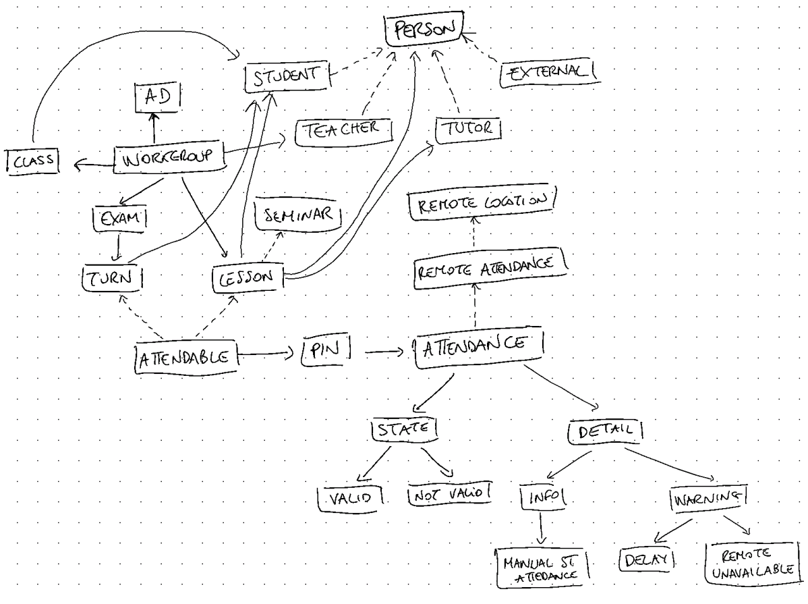
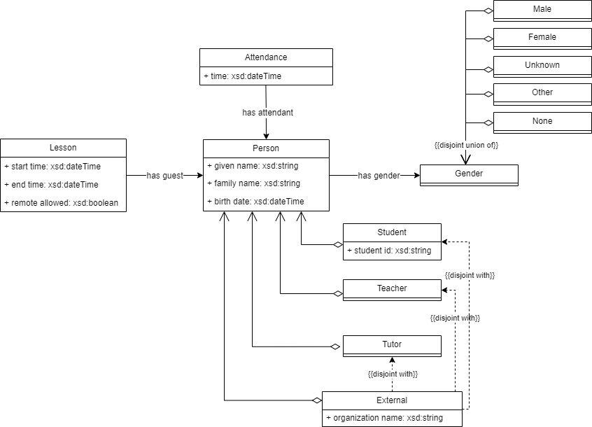
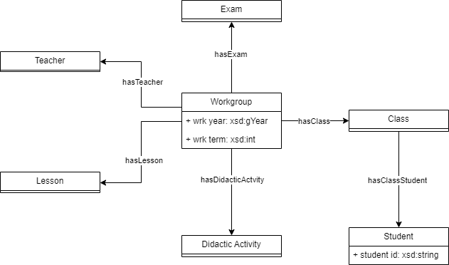
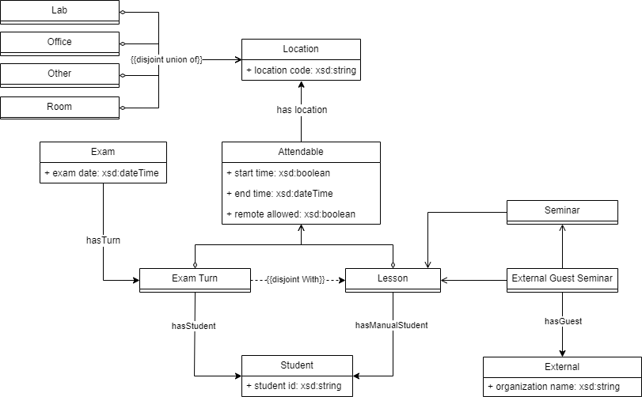
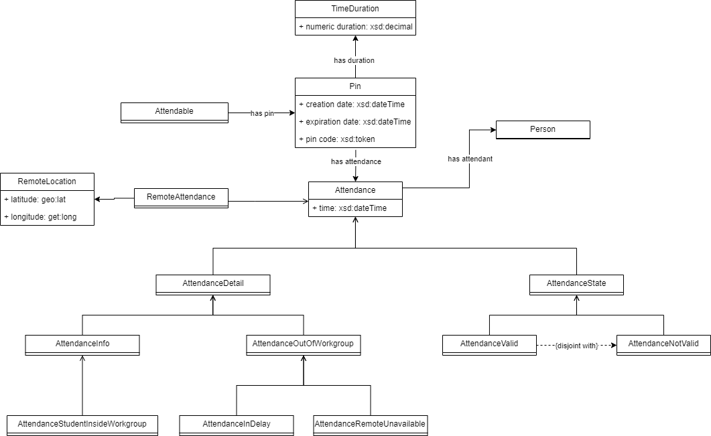

<h1><center>Attendance</center></h1>
<h3><center>Ontologia per la registrazione delle presenze in aula</center></h3>
<h5><center>Relazione elaborato Web Semantico</center></h5>

<center>
<table>
<tbody>
<td>
<span><center>Luca Giorgietti</center></span>
<span><center>luca.giorgietti7@studio.unibo.it</center></span>
</td>
<td>
<span><center>Daniele Tentoni</center></span>
<span><center>daniele.tentoni2@studio.unibo.it</center></span>
</td>
</tbody>
</table>
</center>

# Sviluppo Ontologia

In questa ontologia ci siamo prefissati di usare le seguenti tecnologie:

- **RDF**: linguaggio usato per la definizione di triple di dati che permettono di creare delle informazioni utili a chi dovrà usare quegli stessi dati;

- **RDFS**: linguaggio per fornire informazioni aggiuntive dai dati rappresentati usando RDF e che con il supporto di tool specifici chiamati _reasoner_, permette anche di comprendere maggiore conoscenza tramite l'uso di regole semantiche;

- **OWL**: estensione di RDFS, permette di generare ancora più informazione;

- **SPARQL**: linguaggio usato per interrogare ontologie e basi di dati semantiche come quelle in questione;

- **Turtle**: sintassi usata in questi ambiti che risulta di facile lettura anche da utenti umani.

Come piattaforma per l'esecuzione delle query e la preparazione dell'ontologia, abbiamo usato principalmente Protégé, affiancato dall'uso di _reasoner_ e _query engine_ a riga di comando, usati solo per contesti molto limitati a causa delle differenze con quelli supportati da Protègè.

Come ontologie esterne abbiamo incluso:

- [**vCard**](https://www.w3.org/TR/vcard-rdf/): per descrivere le persone e le organizzazioni. Tramite questa ontologia si potrebbero modellare meglio anche le istituzioni di cui fanno parte le persone descritte: una realtà più grande di un solo istituto accademico, un intero sistema, un campus condiviso da più atenei ecc...

- [**Time**](https://www.w3.org/TR/owl-time/#): per descrivere le proprietà temporali di una qualsiasi risorsa. Nel nostro caso è utilzzata per esprimere le durate temporali dei Pin usati per registrare la presenza e per indicare gli orari di inizio degli appuntamenti.

- [**Geo**](https://www.w3.org/2003/01/geo/): per esprimere la posizione dalla quale viene eseguita una rilevazione a distanza, solitamente contraddistinta dalle coordinate espresse in latitudine e longitudine.

## Presentazione del contesto

L'ontologia in questione nasce dall'interesse dei componenti del gruppo del progetto di esprimere la conoscenza acquisita da un dominio applicativo reale maturata durante gli anni di lavoro presso un'azienda di sviluppo software locale.

Il requisito principale è quello di avere un sistema informatico per registrare la [presenza](#attendance) degli studenti alle varie attività didattiche quali [lezioni](#lesson), [esami](#exam) o altri momenti della vita accademica. Il docente a inizio attività condivide un pin alfanumerico che i partecipanti sono tenuti ad inserire in un apposito portale.

> L'adozione delle tecnologie sopracitate e l'integrazione di ontologie diffuse consentirà a chi usufruisce di questa ontologia di espanderla, includendo anche altre tipologie di impegni che richiedono la registrazione della presenza.

## Classi

Di seguito viene riportato uno schema di massima della nostra ontologia:



_Sopra: uno schema di massima della nostra ontologia_

## Principali classi

### Person

Questa classe rappresenta una qualunque persona interagisca con il sistema.



**Data Properties**

| Nome        | Tipo   |
| ----------- | ------ |
| given name  | string |
| family name | string |
| birth date  | date   |

**Object Properties**

| Nome         | Dominio | Range  |
| ------------ | ------- | ------ |
| hasGender    | Person  | Gender |
| hasAttendant | Gender  | Person |
| hasGuest     | Lesson  | Person |

Nel nostro elaborato essa modella alcune sottoclassi.

#### Teacher

Chi tiene le lezioni di un determinato workgroup.

**Object Properties**

| Nome       | Dominio   | Range   |
| ---------- | --------- | ------- |
| hasTeacher | Workgroup | Teacher |

#### Tutor

Chi aiuta a gestire una specifica lezione.

**Object Properties**

| Nome     | Dominio | Range |
| -------- | ------- | ----- |
| hasTutor | Lesson  | Tutor |

#### Student

Chi partecipa alle lezioni e agli esmi.

**Data Properties**

| Nome      | Tipo   |
| --------- | ------ |
| studentId | string |

#### External

Chi non fa parte dell'organizzazione scolastica, ma viene invitato per tenere seminari.

**Data Properties**

| Nome              | Tipo   |
| ----------------- | ------ |
| organization name | string |

Abbiamo quindi dichiarato questa risorsa DisjointWith con le altre sotto classi di Person: infatti una persona o appartiene all'università o ad una organizzazione esterna.

### Workgroup

Rappresenta la relazione tra:

- una [Classe](#classe)
- un determinato anno didattico e semestre
- una [Attività Didattica](#attivita-didattica).



**Data Property**

| Nome     | Tipo        |
| -------- | ----------- |
| wrk term | xsd:integer |
| wrk year | xsd:integer |

**Object Property**

| Nome                | Dominio   | Range            |
| ------------------- | --------- | ---------------- |
| hasClass            | Workgroup | Class            |
| hasDidacticActivity | Workgroup | DidacticActivity |
| hasExam             | Workgroup | Exam             |
| hasLesson           | Workgroup | Lesson           |
| hasTeacher          | Workgroup | Teacher          |

#### Class

Rappresenta un gruppo di studenti iscritti ad un certo anno accademico.

**Object Properties**

| Nome            | Dominio                 | Range               |
| --------------- | ----------------------- | ------------------- |
| hasClass        | [Workgroup](#workgroup) | Class               |
| hasClassStudent | Class                   | [Student](#student) |

#### Didactic Activity

Rappresenta un corso di studio insegnato nella scuola.

**Object Property**

| Nome                | Dominio   | Range            |
| ------------------- | --------- | ---------------- |
| hasDidacticActivity | Workgroup | DidacticActivity |

### Attendable

Rappresenta una attività sulla quale può essere registrata una presenza.



Da notare che questo concetto non viene completamente esaurito in questa ontologia. Infatti possono essere rappresentati anche altri tipi di eventi che richiedono di registrare la presenza degli utenti, come ad esempio riunioni di docenti (e di altro personale) o ricevimenti privati.

**Data Property**

| Nome           | Tipo    |
| -------------- | ------- |
| start time     | date    |
| end time       | date    |
| remote allowed | boolean |

**Object Property**

| Nome                                                | Dominio    | Range                 |
| --------------------------------------------------- | ---------- | --------------------- |
| hasLocation                                         | Attendable | [Location](#location) |
| hasPin                                              | Attendable | [Pin](#pin)           |

Possiamo affermare che la proprietà _hasPin_ è **inversamente funzionale**: infatti una lezione può avere molti pin, mentre ogni pin oggetto di questa relazione può averne una sola di questo tipo verso una lezione. Possiamo quindi dire che la relazione inversa di hasPin, ovvero isPinOf, è funzionale.

### Lesson

Rappresenta un lasso di tempo dove gli [studenti](#student) seguono un [docente](#teacher). Eventualmente, il docente può essere aiutato o sostituito da un [tutor](#tutor).

**Object Property**

| Nome      | Dominio                 | Range                 |
| --------- | ----------------------- | --------------------- |
| hasGuest  | Lesson                  | [Person](#person)     |
| hasLesson | [Workgroup](#workgroup) | Lesson                | 
| hasTutor  | Lesson                  | [Tutor](#tutor)       |
| [hasManualStudent](#hasstudent-vs-hasmanualstudent) | Attendable | [Student](#student)   |


Nella nostra ontologia sono presenti anche altre due risorse sottoclassi di questa:

- **Seminar**: Seminario tenuto da una persona diversa dal titolare dell'insegnamento.

- **External Guest Seminar**: Sottoclasse di Seminar, contraddistingue i seminari da un ospire esterno all'università, invitato dal docente. Nella nostra ontologia questo è rappresentato dalla classe [External](#external).

### Exam

Rappresenta l'insieme di prove d'esame degli [studenti](#student) per un determinato workgroup.

**Data Property**

| Nome      | Tipo |
| --------- | ---- |
| exam date | date |

**Object Property**

| Nome    | Dominio   | Range                   |
| ------- | --------- | ----------------------- |
| hasExam | Workgroup | Exam                    |
| hasTurn | Exam      | [Exam Turn](#exam-turn) |

#### Exam Turn

Rappresenta un lasso di tempo dove una parte di studenti iscritti ad un esame svolge la propria prova. Questa divisione è necessaria in quanto non sempre negli atenei sono presenti aule abbastanza capienti per contenere tutti gli studenti contemporaneamente.

Tra le varie motivazioni, ci può essere la necessità di svolgere la prova su dei supporti specifici (come dei computer per le prove di informatica) o per via del distanziamento tra i presenti (in un'aula da 200 persone, potrebbero riuscirci a stare soltato 50 persone durante un'esame).

**Object Property**

| Nome       | Dominio       | Range                 |
| ---------- | ------------- | --------------------- |
| hasTurn    | [Exam](#exam) | Exam Turn             |
| hasStudent | Attendable    | [Student](#student)   |

### Pin

Rappresenta un codice alfanumerico che le persone inseriscono per registrare la loro presenza ad un [Attendable](#attendable). Questo viene generato dal sistema e fornito da chi gestisce l'attività.

**Data Property**

Possiede una data di creazione (creation date) da valorizzare quando viene generato il Pin,
È usata anche per calcolare la data di scadenza di quel Pin tramite la regola PinExpirationDate[^1]. Allo scoccare della scadenza la registrazione verrà considerata come ritardo o assenza.

[^1]: La regola è valida, ma attualmente alla versione 5.6.2 non è supportata da Pellet

| Nome            | Tipo   |
| --------------- | ------ |
| creation date   | date   |
| expiration date | date   |
| code            | string |

**Object Property**

| Nome           | Dominio | Range                     |
| -------------- | ------- | ------------------------- |
| hasAttendance  | Pin     | [Attendance](#attendance) |
| pinHasDuration | Pin     | time:Duration             |

Possiamo affermare che la proprietà _hasAttendance_ è una proprietà **inversamente funzionale**: infatti un Pin può avere più Attendance, mentre un Attendance può avere un solo Pin su cui essere registrato.

### Attendance

Rappresenta una registrazione di una presenza.



La registrazione richiede un [Pin](#pin) associato ad un [Attendable](#attendable), cioè un impegno sul quale possa essere registrata una presenza.

Questa registrazione tiene traccia della presenza/assenza di un partecipante. Inoltre tiene conto anche del fatto che uno studente presente sia entrato puntuale o sia essendo in ritardo, se si sia registrato da remoto e se sia iscritto al workgroup dell'attendable in questione.

Le presenze _Valide_ e _Invalide_, sono insiemi disgiunti di classi. In questo ci è venuta in aiuto l'espressività concessa da OWL. Abbiamo potuto esprimere questo fatto con le seguenti regole:

```
attendance-ontology:AttendanceNotValid rdf:type owl:Class ;
    rdfs:subClassOf attendance-ontology:Attendance ;
    owl:disjointWith attendance-ontology:AttendanceValid .
```

Le varie possibilità offerte attualmente dall'ontologia sono:

- Registrazione non valida (AttendanceNotValid):

  - <a id="AttendanceNotValidAlreadySubmitted">Registrazione già sottoposta (AttendanceNotValidAlreadySubmitted)</a>: uno studente si è sbagliato e ha registrato più di una volta la sua presenza sulla stessa lezione

  - <a id="AttendanceNotValidOutOfWorkgroup">Registrazione di uno studente fuori workgroup (AttendanceNotValidOutOfWorkgroup)</a>: uno studente si è registrato alla lezione nonostante non sia interno al workgroup della lezione e non fosse segnato tra gli studenti al quale è consentito come studenti manuali

  - <a id="AttendanceNotValidWithDelay">Registrazione con ritardo (AttendanceNotValidWithDelay)</a>: questa classe differisce da [AttendanceValidWithDelay](#attendancevalidwithdelay) in quanto il ritardo il questione è così tanto da non poter più considerare valida la presenza allo studente

- Registrazione valida (AttendanceValid):

  - <a id="AttendanceValidPresent">Registrazione valida (AttendanceValidPresent)</a>: la presenza dello studente è stata registrata entro l'inizio della lezione

  - <a id="AttendanceValidWithDelay">Registrazione con ritardo (AttendanceValidWithDelay)</a>: questa classe differisce da [AttendanceNotValidWithDelay](#AttendanceNotValidWithDelay) in quanto il ritardo in questo caso non è così tanto da considerare invalida la presenza allo studente

Le registrazioni fatte da remoto sono contraddistinte dalla proprità remote settata a `true`. In questo caso subentra il controllo da parte della regola [RemoteAttendance](#remoteattendance) che verifica se un attendance eseguito da remoto è consentito dall'attendable stesso, tramite la proprietà remote allowed.

**Data Property**

| Nome   | Tipo    |
| ------ | ------- |
| remote | boolean |

**Object Property**

| Nome          | Dominio    | Range  |
| ------------- | ---------- | ------ |
| hasAttendance | Pin        | Person |
| hasAttendant  | Attendance | Person |

## Object Properties

Di seguito vengono specificate le principali Object Properties modellate.

### hasStudent vs hasManualStudent

La proprietà hasStudent esprime un elenco di studenti che ci si aspetta si registrino ad un Attendable, in quanto appartenenti alle classi del workgroup associato. La seconda invece esprime un elenco di studenti aggiunti a posteriori ad un Attendable. In genere questi vengono aggiunti a mano da un operatore su richiesta di un ufficio o di un dipartimento, perché si intende fare seguire ad uno studente una lezione, per via di un dottorato in corso o altre esigenze di formazione degli studenti.

Quindi nella nostra ontologia abbiamo modellato hasManualStudent come sotto proprietà di hasStudent, in quanto tutti gli studenti aggiunti come manuali sono comunque degli studenti registrabili.

# Regole Semantiche

**Rules**:

- [PinExpirationDate](#pinexpirationdate)

- [RemoteAttendance](#remoteattendance)

- [Seminar](#seminar)

- [ExternalGuestSeminar](#externalguestseminar)

- [ValidateAttendanceStudentInsideWorkgroup](#validateattendancestudentinsideworkgroup)

## PinExpirationDate

```swrl
attendance-ontology:Pin(?pin) ^
attendance-ontology:creation-date(?pin, ?creationDate) ^
swrlb:dayTimeDuration(?pinDuration, 0, 0, 15, 0) ^
swrlb:addDayTimeDurationToDateTime(?result, ?creationDate, ?pinDuration)

-> attendance-ontology:expiration-date(?pin, ?result)
```

Questa regola consente di valorizzare l'orario di scadenza di un Pin in base alla sua data di creazione. Nell'ontologia di esempio proposta, abbiamo assunto che tutti i Pin abbiano una durata di 15 minuti di durata. Tuttavia la regola non viene effettivamente utilizzata poiché Protégé non riesce ad elaborarla attraverso il tool integrato in esso _Drool rule engine_ o _Pellet_. Abbiamo infatti realizzato la query `PinExpirationDateQueryRule`, per dimostrare che la regola PinExpirationDate sia formulata correttamente.

## RemoteAttendance

```swrl
attendance-ontology:Lesson(?lesson) ^
attendance-ontology:Pin(?pin) ^
attendance-ontology:hasPin(?lesson, ?pin) ^
attendance-ontology:Attendance(?attendance) ^
attendance-ontology:hasAttendance(?pin, ?attendance) ^
attendance-ontology:RemoteAttendance(?attendance) ^
attendance-ontology:allow-remote(?lesson, ?remote_val) ^
swrlb:notEqual(?remote_val, true)
-> attendance-ontology:AttendanceNotValidNoRemoteAllowed(?attendance)
```

Questa regola permette di inferire l'appartenenza alla classe AttendanceNotValidNoRemoteAllowed per tutti gli Attendance che hanno la data property _remote_ valorizzata a `true` ma che sono stati registrati per un Attendable con _allow remote_ settato a `false`.

## Seminar

```swrl
attendance-ontology:Lesson(?lesson) ^
attendance-ontology:hasGuest(?lesson, ?guest)
-> attendance-ontology:Seminar(?lesson)
```

Questa regola permetter di inferire se una lezione appartenga anche al tipo specifico _Seminar_.

## ExternalGuestSeminar

```swrl
attendance-ontology:Seminar(?lesson) ^
attendance-ontology:hasGuest(?lesson, ?guest) ^
attendance-ontology:External(?guest)
-> attendance-ontology:ExternalGuestSeminar(?lesson)
```

Questa regola sfrutta la regola _Seminar_ e permette di inferire se una lezione appartenga anche al tipo specifico _ExternalGuestSeminar_.

## ValidateManualStudentAttendance

```swrl
attendance-ontology:hasPin(?lesson, ?pin) ^ 
attendance-ontology:Lesson(?lesson) ^ 
attendance-ontology:hasManualStudent(?lesson, ?student) ^ 
attendance-ontology:hasAttendant(?attendance, ?student) ^ 
attendance-ontology:hasAttendance(?pin, ?attendance) 
-> attendance-ontology:ManualStudentAttendance(?attendance)
```

Questa regola controlla se l'attendance in questione è stato eseguito o meno da uno studente inserito all'interno della lezione direttamente dal docente, senza essere all'interno della classe del workgroup della lezione.

## ValidateAttendanceInDelay

```swrl
attendance-ontology:Attendance(?attendance) ^
attendance-ontology:attendance-time(?attendance, ?attTime) ^
attendance-ontology:isAttendanceOf(?attendance, ?pin) ^
attendance-ontology:isPinOf(?pin, ?wrk) ^
attendance-ontology:expiration-date(?pin, ?expDate) ^
swrlb:greaterThan(?attTime, ?expDate)
-> attendance-ontology:AttendanceInDelay(?attendance)
```

Questa regola inferisce che una presenza è stata registrata in ritardo rispetto l'orario di scadenza del pin.

## ValidateAttendanceRemoteUnavailable

```swrl
attendance-ontology:hasPin(?lesson, ?pin) ^
attendance-ontology:Pin(?pin) ^
attendance-ontology:RemoteAttendance(?attendance) ^
attendance-ontology:Lesson(?lesson) ^
attendance-ontology:Attendance(?attendance) ^
swrlb:notEqual(?remote_val, true) ^
attendance-ontology:remote-allowed(?lesson, ?remote_val) ^
attendance-ontology:hasAttendance(?pin, ?attendance)
-> attendance-ontology:AttendanceRemoteUnavailable(?attendance)
```

Questa regola inferisce che una presenza è stata registrata da remoto quando invece non era permesso.

# Interrogazioni

Tramite questa sintassi esprimiamo alcune delle più comuni query che potrebbero essere svolte sulla nostra ontologia.

**Query**:

- [Ultimo pin creato per un Attendable](#ultimo-pin-valido-per-un-determinato-attendable)
- [Tutti i workgroup attivi per un determinato utente](#tutti-i-workgroup-attivi-per-un-determinato-utente)
- [Estrai uno studente presente casualmente](#estrai-uno-studente-presente-casualmente)
- [Studenti che possono sostenere l'esame (presenze > di tot %)](#studenti-che-possono-sostenere-lesame-presenze--di-tot)
- [Registro delle presenze](#registro-delle-presenze)
- [Workgroup poco partecipati](#workgroup-poco-partecipati)

Il codice di tutte le query generate per il progetto può essere consultato su [Github](https://github.com/lucagiorgietti)

## Ultimo pin valido per un determinato attendable

Selezioniamo l'ultimo pin valido per un attendable. Questa interrogazione viene usata quando si vuole presentare il pin sul quale gli studenti possono registrare la loro presenza.

In questo caso l'Attendable da usare è già noto, basta ordinare per data di creazione decresente i Pin che sono di un certo Attendable e prendere solo il primo.

```sparql
SELECT ?pin ?code ?expirationDate WHERE {
    ?attendable att:hasPin ?pin .
    ?pin att:creation-date ?creationDate ;
        att:expiration-date ?expirationDate ;
        att:pin-code ?code .

    BIND( now() AS ?currentDateTime ) # Get current date time
    FILTER (?expirationDate >= ?currentDateTime)
    FILTER (?attendable = att:LES_WS_2023_05_21) # This is the parameter
}

ORDER BY DESC(?creationDate) LIMIT 1
```

Eseguendo questa interrogazione viene prodotto il risultato:

```sh
----------------------------------------------------
| pin          | code     | expirationDate         |
====================================================
| att:PIN_WS_5 | "666799" | "2023-09-21T11:15:00Z" |
----------------------------------------------------
```

## Tutti i workgroup attivi per un determinato utente

Selezioniamo tutti i workgroup attivi per un utente per capire quali lezioni dovrà seguire o quali esami sostenere.

```sparql
# Retrieve all workgroup for a student.
SELECT ?workgroup ?da ?teacher ?term WHERE {
    ?student att:isClassStudentOf ?class . 
    ?class att:isClassOf ?workgroup .
    ?workgroup att:hasDidacticActivity ?da ;
        att:hasTeacher ?teacher ;
        att:wrk-term ?term .

    FILTER (?student = att:STU_00001_MarioRossi)
}

ORDER BY ?term
```

Eseguendo questa interrogazione viene prodotto il risultato:

```sh
---------------------------------------------------------------------------------------------------------------
| workgroup                                 | da                        | teacher                      | term |
===============================================================================================================
| att:WRK_CL_001_DA_PervasiveComputing_2023 | att:DA_PervasiveComputing | att:TR_AlessandroRicci       | "1"  |
| att:WRK_CL_001_DA_ProjectManagement_2023  | att:DA_ProjectManagement  | att:TR_MarcoAntonioBoschetti | "1"  |
| att:WRK_CL_001_DA_WebSemantico_2023       | att:DA_WebSemantico       | att:TR_AntonellaCarbonaro    | "2"  |
---------------------------------------------------------------------------------------------------------------
```

## Estrai uno studente presente casualmente

Seleziono uno studente preso a caso tra i presenti a lezione per verificare se realmente sia presente o è stato registrato da qualcun altro in modo malizioso.

In questo caso devo recuperare da tutti pin usati per la lezione tutte le presenze di un qualsiasi tipo valido e ne leggo soltanto una, la prima tra tutte quelle recuperate riordinate a caso.

```sparql
# Retrieve all attendance from an attendable.
SELECT ?student WHERE {
    ?attendable att:hasPin ?pin .
    ?pin att:hasAttendance ?attendance .
    ?attendance att:hasAttendant ?student ;
        rdf:type att:AttendanceValid .

    FILTER (?attendable = att:LES_WS_2023_05_22) # This is the parameter
}

# Then order them randomly and take the first one.
ORDER BY RAND() LIMIT 1
```

Eseguendo questa interrogazione viene prodotto il risultato:

```sh
----------------------------
| student                  |
============================
| att:STU_00001_MarioRossi |
----------------------------
```

## Studenti che non possono sostenere l'esame (presenze < di tot %)

Otteniamo tutti gli studenti che sono iscritti ad un esame ma che non hanno la percentuale di presenza superiore ad una certa soglia (nel nostro esempio 75%).

```sparql
# Get all student not admittable to an exam of a given workgroup. 
SELECT ?student ?percentage WHERE {
    # Get all students attending the exam.
    {
        SELECT ?wrk ?student WHERE {
            ?wrk att:hasExam ?exam .
            ?exam att:hasTurn ?turn .
            ?turn att:hasStudent ?student . 
        }
    }
    # Get all attendances of them.
    {
        SELECT ?wrk ?student (count(?attendance) AS ?tot_freq) WHERE {
            ?wrk att:hasClass ?class .
            ?class att:hasClassStudent ?student .
            
            OPTIONAL {
                ?wrk att:hasLesson ?lesson .
                ?lesson att:hasPin ?pin .
                ?pin att:hasAttendance ?attendance .
                ?attendance att:hasAttendant ?student ;
                    rdf:type att:AttendanceValid .
            }
        }
        
        GROUP BY ?wrk ?student
    }
    # Get all expected attendances by them.
    {
        SELECT ?wrk (count(?lesson) AS ?tot) WHERE {
            ?wrk att:hasLesson ?lesson .
        }

        GROUP BY ?wrk
    }

    # Get the percentage of attended lessons.
    BIND ((?tot_freq / ?tot * 100) AS ?percentage)
    # Filter them by Workgroup and percentage.
    FILTER (?percentage < 75)
    FILTER (?wrk = att:WRK_CL_001_DA_ProjectManagement_2023)
}

```

Eseguendo questa interrogazione viene prodotto il risultato:

```sh
-----------------------------------------------------------
| student                     | percentage                |
===========================================================
| att:STU_00002_LuigiVerdi    | 66.6666666666666666666667 |
| att:STU_00003_ChiaraBianchi | 66.6666666666666666666667 |
-----------------------------------------------------------
```

## Registro delle presenze

```sparql
# Students of the specified lesson and their attendance.
SELECT DISTINCT ?student ?type ?warning ?info WHERE {
    {
        ?lesson att:hasManualStudent ?student . 
    }
    UNION
    {
        ?lesson att:isLessonOf ?workgroup .
        ?workgroup att:hasClass ?class . 
        ?class att:hasClassStudent ?student .
    }

    OPTIONAL { 
        ?lesson att:hasPin ?pin .
        ?pin att:hasAttendance ?attendance .
        ?attendance att:hasAttendant ?student ;
            rdf:type ?type .
        ?type rdfs:subClassOf att:AttendanceState .

        OPTIONAL {
            ?attendance rdf:type ?warning.
            ?warning rdfs:subClassOf att:AttendanceWarning .
        }

        OPTIONAL {
            ?attendance rdf:type ?info.
            ?info rdfs:subClassOf att:AttendanceInfo .
        }
    }

    FILTER (?lesson = att:LES_PM_2023_05_01)
}

ORDER BY ?student
```

Eseguendo questa interrogazione viene prodotto il risultato:

```sh
------------------------------------------------------------------------------------------------------------------------
| student                     | type                   | warning                         | info                        |
========================================================================================================================
| att:STU_00001_MarioRossi    | att:AttendanceValid    | att:AttendanceInDelay           |                             |
| att:STU_00002_LuigiVerdi    | att:AttendanceNotValid | att:AttendanceInDelay           |                             |
| att:STU_00002_LuigiVerdi    | att:AttendanceNotValid | att:AttendanceRemoteUnavailable |                             |
| att:STU_00003_ChiaraBianchi | att:AttendanceValid    | att:AttendanceInDelay           |                             |
| att:STU_00004_EMMA_MARRONE  | att:AttendanceValid    | att:AttendanceInDelay           | att:ManualStudentAttendance |
------------------------------------------------------------------------------------------------------------------------
```

## Workgroup poco partecipati

Secondo noi è anche interessante sapere quali siano i Workgroup con scarsa partecipazione. Possiamo avere bisogno di sapere quali siano le Attività Didattiche che riscontrano poco successo tra gli studenti per capire come migliorarle o come sostituirle negli anni successivi.

```sparql
# Get all workgroups with attendance rate under 50%.
SELECT ?wrk ?rapporto WHERE {
    {
        # Get all attendances of all workgroups.
        SELECT ?wrk (count(?attendance) AS ?tot_freq) WHERE {
            ?wrk att:hasClass ?class .
            ?class att:hasClassStudent ?student .
            
            OPTIONAL {
                ?wrk att:hasLesson ?lesson .
                ?lesson att:hasPin ?pin .
                ?pin att:hasAttendance ?attendance .
                ?attendance att:hasAttendant ?student ;
                    rdf:type att:AttendanceValid .
            }
        }

        GROUP BY ?wrk
    }
    {
        # Get all maximum presences of stedents.
        SELECT ?wrk (count(?student) AS ?exp_freq) WHERE {
            ?wrk att:hasClass ?class .
            ?class att:hasClassStudent ?student .
            
            OPTIONAL {
                ?wrk att:hasLesson ?lesson .
            }
        }
        
        GROUP BY ?wrk
    }
    
    # Calculate the attendance rate.
    BIND (?tot_freq / ?exp_freq * 100 AS ?rapporto)
    FILTER (?rapporto < 50)
}
```

Eseguendo questa interrogazione viene prodotto il risultato:

```sh
-------------------------------------------------------------------------
| wrk                                       | rapporto                  |
=========================================================================
| att:WRK_CL_002_DA_ProjectManagement_2023  | 0.0                       |
| att:WRK_CL_002_DA_WebSemantico_2023       | 0.0                       |
| att:WRK_CL_001_DA_PervasiveComputing_2023 | 0.0                       |
| att:WRK_CL_001_DA_WebSemantico_2023       | 44.4444444444444444444444 |
-------------------------------------------------------------------------
```

# Futuri sviluppi

- [Foaf](http://xmlns.com/foaf/0.1/#): per descrivere le relazioni tra le persone. Di questa ontologia potrebbero essere utilizzati ad esempio:

  - [foaf:knows](http://xmlns.com/foaf/0.1/#term_knows)

    Potrebbero essere create proprietà da inferire come: compagni di classe (tra studenti), colleghi di lavoro (tra docenti), ecc...

  - [foaf:publications](http://xmlns.com/foaf/0.1/#term_publications)

    Un relatore di un seminario potrebbe infatti aver pubblicato libri e articoli.

# Conclusioni

Le tecnologie studiate durante questo corso trovano molto successo in ambienti nei quali è fondamentale essere aperti all'innovazione, al cambiamento e all'integrazione con altri sistemi e basi di conoscenza. Nel nostro ambito lavorativo ciò avviene raramente (purtroppo) e quando accade che i dati debbano essere condivisi con altri partner dei nostri clienti, occorre ogni volta spendere tantissime ore per trasmettere il knowhow e concordare la struttura dei dati esposti. Sarebbe utile avere la possibilità di integrare anche la conoscenza in modo veloce tra i vari fornitori di servizi informatici di un ateneo o di un apparato scolastico nazionale.

Poter ottenere il numero di persone che eseguono un test di ingresso su scala nazionale, la loro distribuzione, sapere per ogni facoltà quali sono i corsi più o meno frequentati permetterebbe di prendere decisioni direzionali da parte del governo e dei rettori delle università.

Allo stesso tempo, avere una ontologia che descrive in maniera sempre più completa la presenza degli utenti a lezione, permetterebbe al personale scolastico di eseguire query ad-hoc per avere un'idea precisa del dimensionamento necessario delle aule, del potenziale numero di parcheggi necessari e della eventuale necessità di dividere la classe in sottogruppi.

Durante lo sviluppo dell'ontologia, come già descritto precedentemente, abbiamo notato la carenza di piattaforme open e free efficaci per lavorare con queste tecnologie a parte Protégé. Moltissimi software per validare, eseguire query, rappresentare grafici delle ontologie non sono più mantenuti oppure hanno una scarsa documentazione. Anche il supporto da parte della comunità non è stato sempre dei migliori, essendoci trovati ad affrontare problemi piuttosto comuni che non avevano risposte sui forum online o su Stack Overflow.

Nonostante i nostri sforzi, non siamo riusciti a creare un efficace sistema di Continuous Integration che, data la nostra ontologia, effettuasse prima l'inferenza e poi un controllo di validità su tutte le query che venivano aggiunte al progetto. Infatti, tramite le Github Actions riusciamo soltanto a controllare le query eseguite sull'ontologia già arricchità della conoscienza inferita dal reasoner. Questa ontologia arricchita, come _artefatto_ risultato di una computazione, non è bene che sia tracciato sul sistema di versioning, dovrebbe essere generato all'occorrenza. Lanciando Pellet e altri reasoner da linea di comando, il risultato ottenuto era differente da quello prodotto da Pellet all'interno di Protégé.

Ulteriori sviluppi dell'ontologia potrebbero essere:

- uso di [**Foaf**](http://xmlns.com/foaf/0.1/#): per descrivere le relazioni tra le persone, lavorative tra i docenti, tra i docenti e gli esterni, tra i docenti e gli studenti e così via... Di questa ontologia potrebbero essere utilizzati anche:

  - [foaf:knows](http://xmlns.com/foaf/0.1/#term_knows)

    Potrebbero essere create proprietà da inferire come: compagni di classe (tra studenti), colleghi di lavoro (tra docenti), ecc...

  - [foaf:publications](http://xmlns.com/foaf/0.1/#term_publications)
  - [foaf:Organization](http://xmlns.com/foaf/0.1/#term_Organization)

    Un relatore di un seminario potrebbe infatti non appartenere all'ateneo.
